# Sơ Đồ Luồng Xử Lý Các Chức Năng

Tài liệu này mô tả chi tiết luồng xử lý của từng chức năng trong hệ thống `simple-blog-api`.

---

## 1. 🔐 Xác Thực Người Dùng (Authentication)

### 1.1. Đăng Ký Tài Khoản

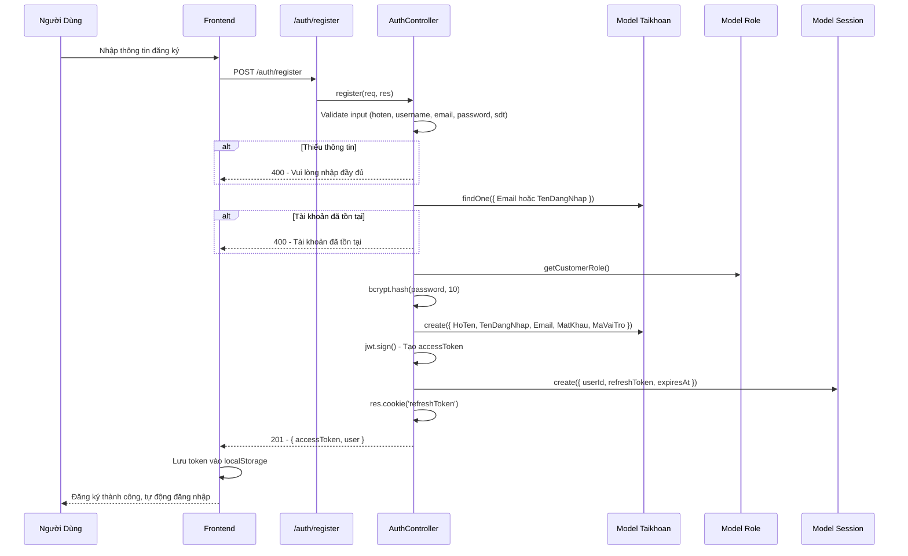

### 1.2. Đăng Nhập

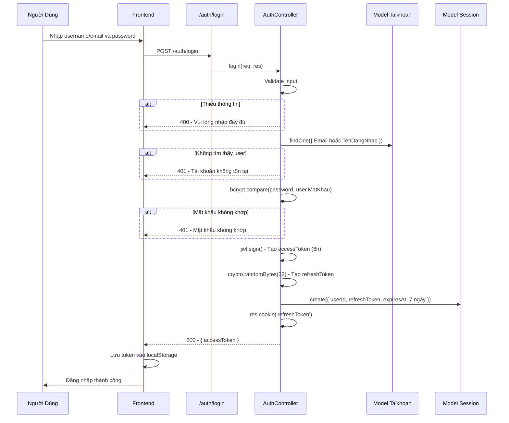

### 1.3. Đăng Xuất

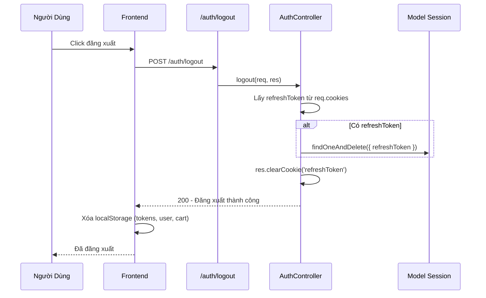

### 1.4. Refresh Token

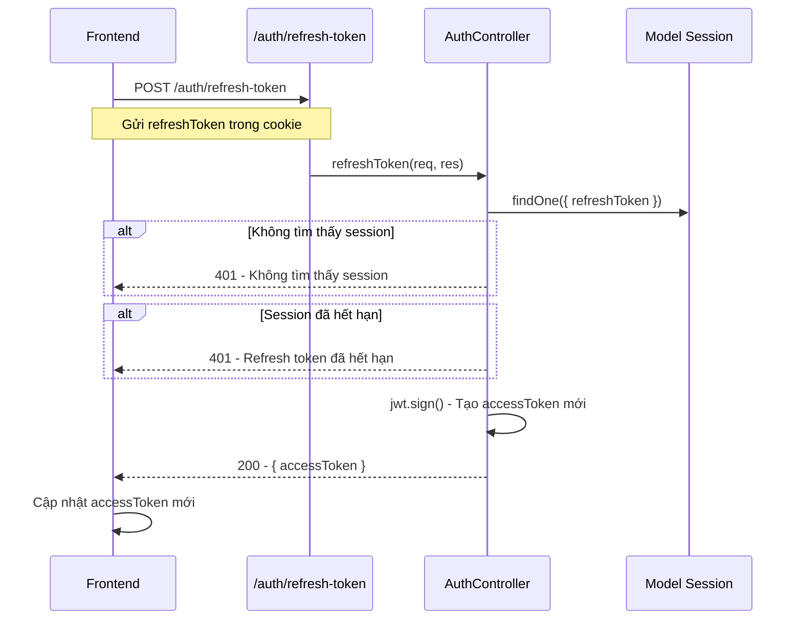

### 1.5. Quên Mật Khẩu

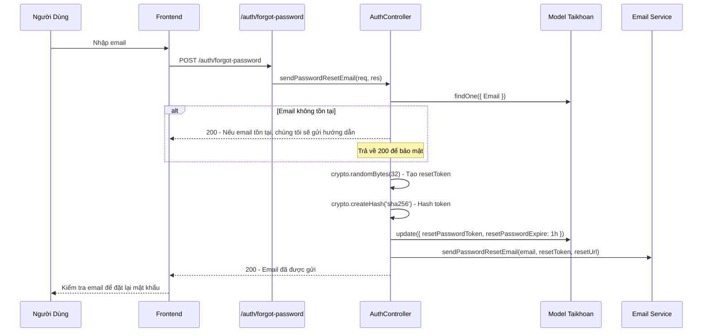

---

## 2. 🛍️ Quản Lý Sản Phẩm

### 2.1. Xem Danh Sách Sản Phẩm (Public)

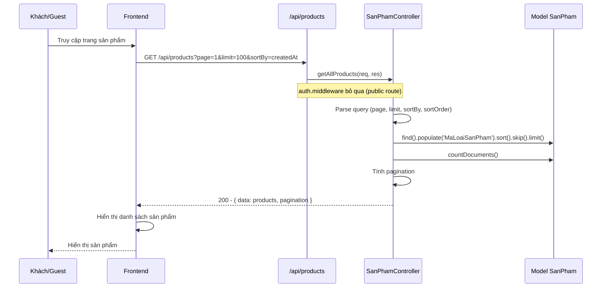

### 2.2. Xem Chi Tiết Sản Phẩm

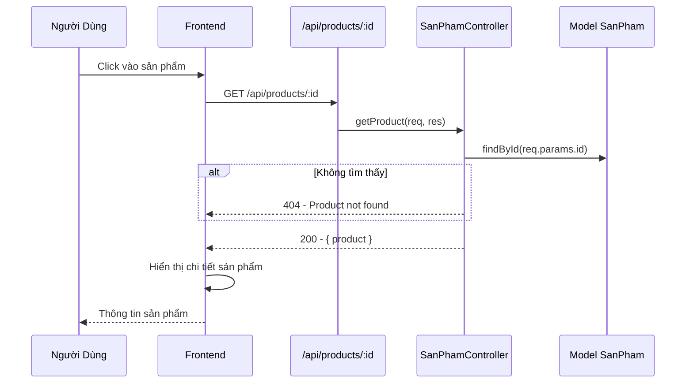

### 2.3. Tạo Sản Phẩm (Admin)

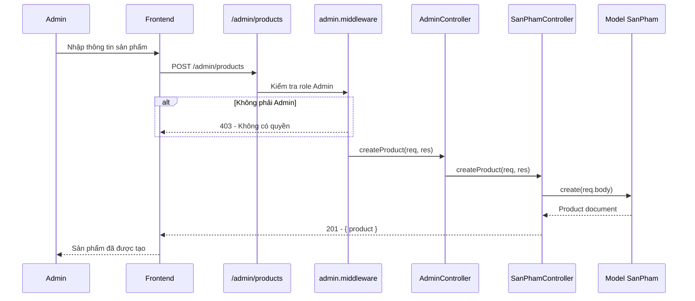

---

## 3. 🛒 Quản Lý Giỏ Hàng

### 3.1. Thêm Sản Phẩm Vào Giỏ Hàng

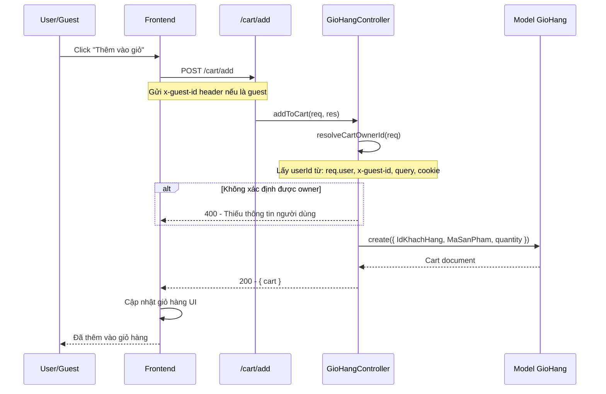

### 3.2. Đồng Bộ Giỏ Hàng Từ LocalStorage

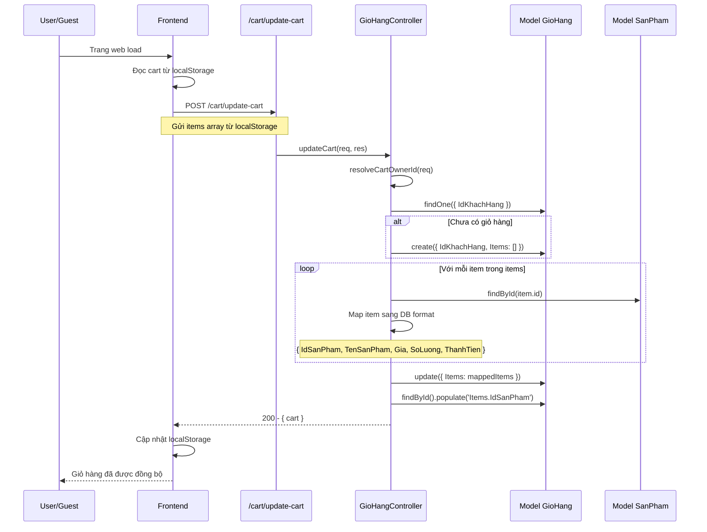

### 3.3. Lấy Giỏ Hàng

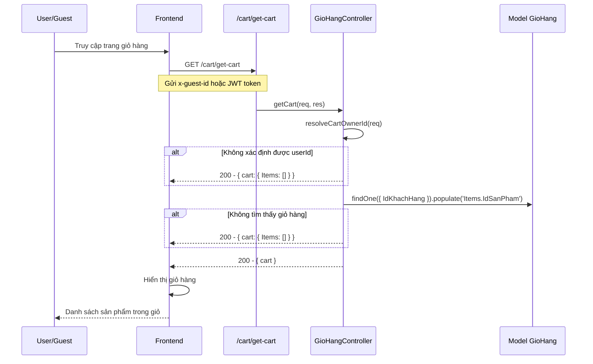

---

## 4. 💳 Quản Lý Đơn Hàng

### 4.1. Checkout (User đã đăng nhập)

```mermaid
sequenceDiagram
    participant User as User
    participant Frontend as Frontend
    participant CartRoute as /cart/checkout
    participant OptionalAuth as optionalAuth.middleware
    participant DonHangController as DonHangController
    participant DonHang as Model DonHang

    User->>Frontend: Click "Thanh toán"
    Frontend->>CartRoute: POST /cart/checkout
    Note over Frontend,CartRoute: Gửi JWT token
    
    CartRoute->>OptionalAuth: Gắn req.user nếu có token
    OptionalAuth->>DonHangController: checkout(req, res)
    
    DonHangController->>DonHangController: Validate (SanPham, TongTien, PhuongThucThanhToan)
    alt Thiếu thông tin
        DonHangController-->>Frontend: 400 - Thiếu thông tin
    end
    
    DonHangController->>DonHangController: buildAddressFromInput(DiaChi)
    DonHangController->>DonHangController: normalizeGuestInfo(ThongTinNhanHang)
    
    DonHangController->>DonHang: create({
        MaKhachHang: userId,
        SanPham,
        TongTien,
        DiaChi,
        PhuongThucThanhToan,
        TrangThai: 'pending'
    })
    
    alt PhuongThucThanhToan === 'COD'
        DonHangController-->>Frontend: 200 - { orderId, requiresPayment: false }
    else PhuongThucThanhToan === 'VNPay'
        DonHangController-->>Frontend: 200 - { orderId, requiresPayment: true }
        Frontend->>Frontend: Chuyển đến trang thanh toán VNPay
    end
```

### 4.2. Guest Checkout

```mermaid
sequenceDiagram
    participant Guest as Guest
    participant Frontend as Frontend
    participant CartRoute as /cart/checkout
    participant DonHangController as DonHangController
    participant DonHang as Model DonHang

    Guest->>Frontend: Nhập thông tin nhận hàng
    Frontend->>CartRoute: POST /cart/checkout
    Note over Frontend,CartRoute: Không có JWT token
    
    CartRoute->>DonHangController: checkout(req, res)
    DonHangController->>DonHangController: Validate ThongTinNhanHang
    alt Thiếu thông tin
        DonHangController-->>Frontend: 400 - Vui lòng nhập đầy đủ
    end
    
    DonHangController->>DonHangController: generateGuestCode()
    Note over DonHangController: guest-${timestamp}-${random}
    
    DonHangController->>DonHang: create({
        MaKhachHang: guestId,
        SanPham,
        TongTien,
        ThongTinNhanHang,
        PhuongThucThanhToan,
        TrangThai: 'pending'
    })
    
    DonHangController-->>Frontend: 200 - { orderId, requiresPayment }
    Frontend-->>Guest: Đơn hàng đã được tạo
```

### 4.3. Xem Đơn Hàng Của User

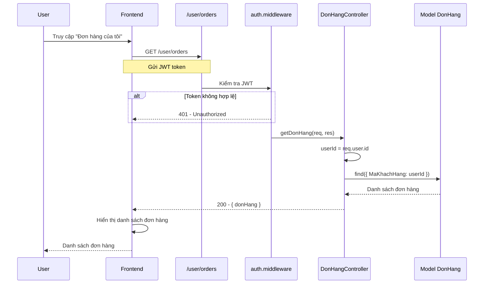

---

## 5. 💰 Thanh Toán VNPay

### 5.1. Tạo URL Thanh Toán VNPay

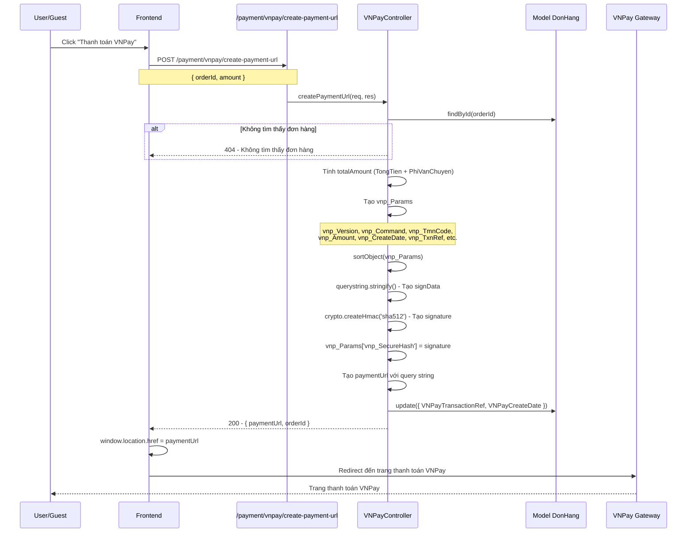

### 5.2. Xử Lý Callback VNPay (Return URL)

```mermaid
sequenceDiagram
    participant VNPay as VNPay Gateway
    participant PaymentRoute as /payment/vnpay/return
    participant VNPayController as VNPayController
    participant DonHang as Model DonHang
    participant Frontend as Frontend

    VNPay->>PaymentRoute: GET /payment/vnpay/return?vnp_ResponseCode=00&...
    PaymentRoute->>VNPayController: vnpayReturn(req, res)
    
    VNPayController->>VNPayController: Lấy vnp_Params từ req.query
    VNPayController->>VNPayController: Loại bỏ vnp_SecureHash
    VNPayController->>VNPayController: sortObject() và tạo signData
    VNPayController->>VNPayController: Tạo hash và so sánh với vnp_SecureHash
    alt Signature không hợp lệ
        VNPayController->>Frontend: Redirect /payment/vnpay-return?status=fail
    end
    
    VNPayController->>VNPayController: Extract orderId từ vnp_TxnRef
    VNPayController->>DonHang: findById(orderId)
    
    VNPayController->>VNPayController: Kiểm tra amount
    alt Amount không khớp
        VNPayController->>Frontend: Redirect /payment/vnpay-return?status=fail
    end
    
    alt vnp_ResponseCode === '00' && vnp_TransactionStatus === '00'
        VNPayController->>DonHang: update({
            TrangThaiThanhToan: 'paid',
            TrangThai: 'confirmed',
            VNPayTransactionId,
            VNPayResponseCode
        })
        VNPayController->>Frontend: Redirect /payment/vnpay-return?status=success&orderId=...
    else Thanh toán thất bại
        VNPayController->>DonHang: update({
            TrangThaiThanhToan: 'failed',
            VNPayResponseCode
        })
        VNPayController->>Frontend: Redirect /payment/vnpay-return?status=fail
    end
    
    Frontend->>Frontend: Hiển thị kết quả thanh toán
    Frontend-->>User: Thông báo kết quả
```

### 5.3. Xử Lý IPN (Instant Payment Notification)

```mermaid
sequenceDiagram
    participant VNPay as VNPay Server
    participant PaymentRoute as /payment/vnpay/ipn
    participant VNPayController as VNPayController
    participant DonHang as Model DonHang

    VNPay->>PaymentRoute: GET /payment/vnpay/ipn?vnp_ResponseCode=00&...
    Note over VNPay,PaymentRoute: Server-to-server notification
    
    PaymentRoute->>VNPayController: vnpayIpn(req, res)
    
    VNPayController->>VNPayController: Verify signature (giống Return URL)
    alt Signature không hợp lệ
        VNPayController-->>VNPay: { RspCode: '97', Message: 'Checksum failed' }
    end
    
    VNPayController->>VNPayController: Extract orderId từ vnp_TxnRef
    VNPayController->>DonHang: findById(orderId)
    alt Không tìm thấy đơn hàng
        VNPayController-->>VNPay: { RspCode: '01', Message: 'Order not found' }
    end
    
    VNPayController->>VNPayController: Kiểm tra amount
    alt Amount không khớp
        VNPayController-->>VNPay: { RspCode: '04', Message: 'Amount mismatch' }
    end
    
    alt Đơn hàng đã được xử lý
        VNPayController-->>VNPay: { RspCode: '00', Message: 'Success' }
    end
    
    alt vnp_ResponseCode === '00' && vnp_TransactionStatus === '00'
        VNPayController->>DonHang: update({
            TrangThaiThanhToan: 'paid',
            TrangThai: 'confirmed',
            VNPayTransactionId
        })
        VNPayController-->>VNPay: { RspCode: '00', Message: 'Success' }
    else Thanh toán thất bại
        VNPayController->>DonHang: update({
            TrangThaiThanhToan: 'failed',
            VNPayResponseCode
        })
        VNPayController-->>VNPay: { RspCode: '00', Message: 'Success' }
    end
```

---

## 6. ⭐ Đánh Giá Sản Phẩm

### 6.1. Tạo Đánh Giá

```mermaid
sequenceDiagram
    participant User as User
    participant Frontend as Frontend
    participant ReviewsRoute as /api/reviews
    participant AuthMiddleware as auth.middleware
    participant DanhGiaController as DanhGiaController
    participant DanhGia as Model DanhGia
    participant SanPham as Model SanPham

    User->>Frontend: Nhập đánh giá và chọn sao
    Frontend->>ReviewsRoute: POST /api/reviews
    Note over Frontend,ReviewsRoute: { IdSanPham, NoiDung, SoSao }
    
    ReviewsRoute->>AuthMiddleware: Kiểm tra JWT
    alt Chưa đăng nhập
        AuthMiddleware-->>Frontend: 401 - Vui lòng đăng nhập
    end
    
    AuthMiddleware->>DanhGiaController: createReview(req, res)
    DanhGiaController->>DanhGiaController: Validate input
    alt Thiếu thông tin
        DanhGiaController-->>Frontend: 400 - Vui lòng nhập đầy đủ
    end
    
    DanhGiaController->>SanPham: findById(IdSanPham)
    alt Không tìm thấy sản phẩm
        DanhGiaController-->>Frontend: 404 - Không tìm thấy sản phẩm
    end
    
    DanhGiaController->>DanhGia: findOne({ IdSanPham, IdKhachHang })
    alt Đã đánh giá rồi
        DanhGiaController-->>Frontend: 400 - Bạn đã đánh giá sản phẩm này
    end
    
    DanhGiaController->>DanhGia: create({
        IdSanPham,
        IdKhachHang: req.user.id,
        NoiDung,
        SoSao
    })
    DanhGiaController->>DanhGia: populate('IdKhachHang')
    DanhGiaController-->>Frontend: 201 - { data: review }
    Frontend->>Frontend: Cập nhật danh sách đánh giá
    Frontend-->>User: Đánh giá đã được gửi
```

### 6.2. Xem Đánh Giá Sản Phẩm (Public)

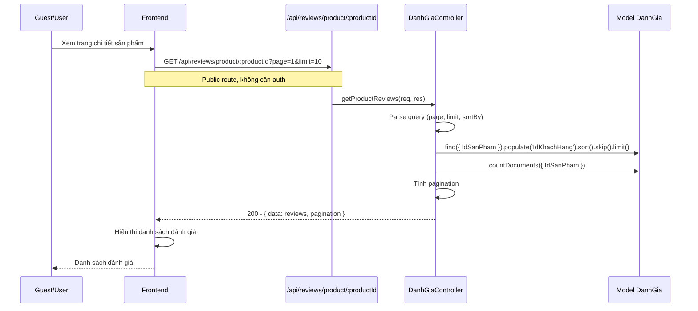

### 6.3. Lấy Thống Kê Rating

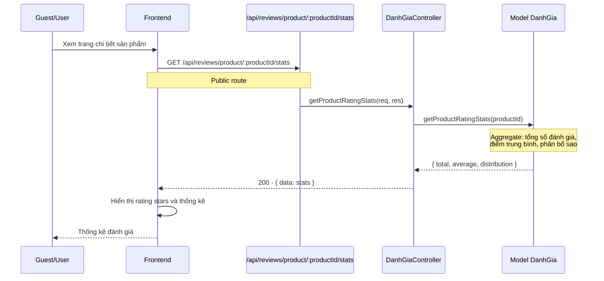

---

## 7. 💬 Chat Hỗ Trợ

### 7.1. Customer Tạo/Lấy Chat Room

```mermaid
sequenceDiagram
    participant Customer as Customer
    participant Frontend as Frontend
    participant ChatRoute as /chat/room
    participant AuthMiddleware as auth.middleware
    participant ChatController as ChatController
    participant ChatRoom as Model ChatRoom

    Customer->>Frontend: Click "Chat hỗ trợ"
    Frontend->>ChatRoute: GET /chat/room
    Note over Frontend,ChatRoute: Gửi JWT token
    
    ChatRoute->>AuthMiddleware: Kiểm tra JWT
    AuthMiddleware->>ChatController: getOrCreateChatRoom(req, res)
    
    ChatController->>ChatController: customerId = req.user.id
    ChatController->>ChatRoom: findOne({
        CustomerId: customerId,
        Status: { $in: ['pending', 'active'] }
    })
    
    alt Chưa có chat room
        ChatController->>ChatRoom: create({
            CustomerId: customerId,
            Status: 'pending'
        })
    end
    
    ChatController->>ChatRoom: populate('AdminId', 'CustomerId')
    ChatController-->>Frontend: 200 - { data: chatRoom }
    Frontend->>Frontend: Kết nối WebSocket với chatRoomId
    Frontend-->>Customer: Mở cửa sổ chat
```

### 7.2. Admin Xem Danh Sách Chat Rooms

```mermaid
sequenceDiagram
    participant Admin as Admin
    participant Frontend as Frontend
    participant ChatRoute as /chat/rooms
    participant RoleMiddleware as role.middleware
    participant ChatController as ChatController
    participant ChatRoom as Model ChatRoom

    Admin->>Frontend: Truy cập trang quản lý chat
    Frontend->>ChatRoute: GET /chat/rooms?status=active&page=1
    Note over Frontend,ChatRoute: Gửi JWT token với role Admin
    
    ChatRoute->>RoleMiddleware: Kiểm tra role Admin
    alt Không phải Admin
        RoleMiddleware-->>Frontend: 403 - Không có quyền
    end
    
    RoleMiddleware->>ChatController: getChatRooms(req, res)
    ChatController->>ChatController: Parse query (status, page, limit)
    ChatController->>ChatRoom: find(query)
        .populate('CustomerId', 'AdminId')
        .sort({ LastMessageAt: -1 })
        .skip().limit()
    ChatController->>ChatRoom: countDocuments(query)
    ChatController->>ChatController: Tính pagination
    ChatController-->>Frontend: 200 - { data: chatRooms, pagination }
    Frontend->>Frontend: Hiển thị danh sách chat rooms
    Frontend-->>Admin: Danh sách chat rooms
```

### 7.3. Admin Nhận Chat Room

```mermaid
sequenceDiagram
    participant Admin as Admin
    participant Frontend as Frontend
    participant ChatRoute as /chat/room/:chatRoomId/assign
    participant ChatController as ChatController
    participant ChatRoom as Model ChatRoom
    participant Socket as WebSocket

    Admin->>Frontend: Click "Nhận chat"
    Frontend->>ChatRoute: POST /chat/room/:chatRoomId/assign
    Note over Frontend,ChatRoute: Gửi JWT token với role Admin
    
    ChatRoute->>ChatController: assignAdmin(req, res)
    ChatController->>ChatController: adminId = req.user.id
    ChatController->>ChatRoom: findById(chatRoomId)
    alt Không tìm thấy
        ChatController-->>Frontend: 404 - Chat room không tồn tại
    end
    
    ChatController->>ChatRoom: update({
        AdminId: adminId,
        Status: 'active'
    })
    ChatController->>ChatRoom: populate('AdminId', 'CustomerId')
    ChatController->>Socket: emit('admin-assigned', { chatRoomId, adminId })
    ChatController-->>Frontend: 200 - { data: chatRoom }
    Frontend->>Frontend: Cập nhật UI
    Frontend-->>Admin: Đã nhận chat room
```

### 7.4. Gửi Tin Nhắn (WebSocket)

```mermaid
sequenceDiagram
    participant User as User/Admin
    participant Frontend as Frontend
    participant Socket as WebSocket Server
    participant ChatMessage as Model ChatMessage
    participant ChatRoom as Model ChatRoom

    User->>Frontend: Gõ tin nhắn và gửi
    Frontend->>Socket: emit('send-message', { chatRoomId, content })
    
    Socket->>Socket: Xác thực user từ token
    Socket->>ChatMessage: create({
        ChatRoomId: chatRoomId,
        SenderId: userId,
        SenderType: 'customer' hoặc 'admin',
        Content: content,
        IsRead: false
    })
    
    Socket->>ChatRoom: findByIdAndUpdate(chatRoomId, {
        LastMessageAt: new Date(),
        $inc: { 'UnreadCount.customer' hoặc 'UnreadCount.admin' }
    })
    
    Socket->>Socket: emit('new-message', message) - Gửi đến tất cả clients trong room
    Socket-->>Frontend: Tin nhắn đã được gửi
    Frontend->>Frontend: Hiển thị tin nhắn mới
    Frontend-->>User: Tin nhắn đã gửi
```

---

## 8. 🔗 Truy Xuất Nguồn Gốc (Supply Chain)

### 8.1. Tra Cứu Chuỗi Cung Ứng

```mermaid
sequenceDiagram
    participant Guest as Guest/User
    participant Frontend as Frontend
    participant SupplyChainRoute as /api/supply-chain/products/:id/trace
    participant SupplyChainController as SupplyChainController
    participant SanPham as Model SanPham
    participant BlockchainService as blockchainTrace.service
    participant Blockchain as Blockchain Network

    Guest->>Frontend: Quét mã QR hoặc nhập mã sản phẩm
    Frontend->>SupplyChainRoute: GET /api/supply-chain/products/:id/trace
    Note over Frontend,SupplyChainRoute: Public route
    
    SupplyChainRoute->>SupplyChainController: getProductTrace(req, res)
    SupplyChainController->>SanPham: findById(productId).populate('MaLoaiSanPham')
    alt Không tìm thấy sản phẩm
        SupplyChainController-->>Frontend: 404 - Không tìm thấy sản phẩm
    end
    
    SupplyChainController->>BlockchainService: buildProductTrace(productDoc)
    BlockchainService->>Blockchain: getTrace(productId)
    alt Chưa có dữ liệu trên blockchain
        BlockchainService-->>SupplyChainController: null
        SupplyChainController-->>Frontend: 404 - Sản phẩm chưa có dữ liệu truy vết
    end
    
    BlockchainService->>BlockchainService: Xây dựng traceData từ blockchain
    Note over BlockchainService: Bao gồm: batchId, sku, events, certificates
    
    BlockchainService-->>SupplyChainController: traceData
    SupplyChainController-->>Frontend: 200 - { data: traceData }
    Frontend->>Frontend: Hiển thị timeline truy vết
    Frontend-->>Guest: Thông tin chuỗi cung ứng
```

### 8.2. Khởi Tạo Sản Phẩm Trên Blockchain (Admin)

```mermaid
sequenceDiagram
    participant Admin as Admin
    participant Frontend as Frontend
    participant SupplyChainRoute as /api/supply-chain/products/:id/init
    participant SupplyChainController as SupplyChainController
    participant SanPham as Model SanPham
    participant Blockchain as Blockchain Network

    Admin->>Frontend: Nhập thông tin sản phẩm và khởi tạo
    Frontend->>SupplyChainRoute: POST /api/supply-chain/products/:id/init
    Note over Frontend,SupplyChainRoute: { batchId, sku }
    
    SupplyChainRoute->>SupplyChainController: initProduct(req, res)
    SupplyChainController->>SupplyChainController: isBlockchainEnabled()
    alt Blockchain chưa kích hoạt
        SupplyChainController-->>Frontend: 503 - Blockchain chưa được kích hoạt
    end
    
    SupplyChainController->>SanPham: findById(productId)
    SupplyChainController->>Blockchain: getTrace(productId)
    alt Đã được khởi tạo
        SupplyChainController-->>Frontend: 400 - Sản phẩm đã được khởi tạo
    end
    
    SupplyChainController->>SupplyChainController: Tạo batchId và sku (nếu không có)
    SupplyChainController->>Blockchain: contract.initProduct(productId, batchId, sku)
    Blockchain-->>SupplyChainController: Transaction hash
    SupplyChainController->>Blockchain: tx.wait() - Đợi confirm
    SupplyChainController-->>Frontend: 200 - { productId, batchId, sku, transactionHash }
    Frontend-->>Admin: Sản phẩm đã được khởi tạo trên blockchain
```

---

## 9. 👨‍💼 Quản Trị (Admin)

### 9.1. Xem Thống Kê Tổng Quan

```mermaid
sequenceDiagram
    participant Admin as Admin
    participant Frontend as Frontend
    participant AdminRoute as /admin/stats/summary
    participant RoleMiddleware as role.middleware
    participant AdminController as AdminController
    participant SanPham as Model SanPham
    participant LoaiSanPham as Model LoaiSanPham
    participant Role as Model Role
    participant TaiKhoan as Model Taikhoan
    participant DonHang as Model DonHang

    Admin->>Frontend: Truy cập Dashboard
    Frontend->>AdminRoute: GET /admin/stats/summary
    Note over Frontend,AdminRoute: Gửi JWT token với role Admin
    
    AdminRoute->>RoleMiddleware: Kiểm tra role Admin
    RoleMiddleware->>AdminController: getSummaryStats(req, res)
    
    AdminController->>SanPham: countDocuments()
    AdminController->>LoaiSanPham: countDocuments()
    AdminController->>Role: countDocuments()
    AdminController->>TaiKhoan: countDocuments()
    AdminController->>DonHang: aggregate([
        { $group: { totalOrders: $sum(1), totalRevenue: $sum('$TongTien') } }
    ])
    
    AdminController->>AdminController: Tổng hợp kết quả
    AdminController-->>Frontend: 200 - {
        totalProducts,
        totalCategories,
        totalRoles,
        totalUsers,
        totalOrders,
        totalRevenue
    }
    Frontend->>Frontend: Hiển thị dashboard với charts
    Frontend-->>Admin: Thống kê tổng quan
```

### 9.2. Quản Lý Đơn Hàng (Admin)

```mermaid
sequenceDiagram
    participant Admin as Admin
    participant Frontend as Frontend
    participant AdminRoute as /admin/orders
    participant AdminController as AdminController
    participant DonHangController as DonHangController
    participant DonHang as Model DonHang
    participant TaiKhoan as Model Taikhoan

    Admin->>Frontend: Truy cập "Quản lý đơn hàng"
    Frontend->>AdminRoute: GET /admin/orders?page=1&limit=50&status=pending
    Note over Frontend,AdminRoute: Gửi JWT token với role Admin
    
    AdminRoute->>AdminController: getAllOrders(req, res)
    AdminController->>DonHangController: getAllOrders(req, res)
    DonHangController->>DonHangController: Parse query (page, limit, status, sortBy)
    DonHangController->>DonHang: find(filter).sort().skip().limit()
    DonHangController->>DonHang: countDocuments(filter)
    
    loop Với mỗi order
        DonHangController->>TaiKhoan: findById(order.MaKhachHang)
        DonHangController->>DonHangController: Tạo maDonHang từ _id
        DonHangController->>DonHangController: Gộp thông tin customer vào order
    end
    
    DonHangController->>DonHangController: Tính pagination
    DonHangController-->>Frontend: 200 - { data: ordersWithCustomer, pagination }
    Frontend->>Frontend: Hiển thị bảng đơn hàng
    Frontend-->>Admin: Danh sách đơn hàng với thông tin khách hàng
```

### 9.3. Cập Nhật Trạng Thái Đơn Hàng

```mermaid
sequenceDiagram
    participant Admin as Admin
    participant Frontend as Frontend
    participant AdminRoute as /admin/orders/:id
    participant AdminController as AdminController
    participant DonHangController as DonHangController
    participant DonHang as Model DonHang

    Admin->>Frontend: Chọn đơn hàng và cập nhật trạng thái
    Frontend->>AdminRoute: PUT /admin/orders/:id
    Note over Frontend,AdminRoute: { TrangThai, PhuongThucThanhToan, GhiChu, ... }
    
    AdminRoute->>AdminController: updateOrder(req, res)
    AdminController->>DonHangController: updateDonHang(req, res)
    DonHangController->>DonHangController: Validate orderId
    DonHangController->>DonHangController: Build updateFields từ req.body
    DonHangController->>DonHang: findByIdAndUpdate(orderId, { $set: updateFields }, { new: true })
        .populate('MaKhachHang')
    
    alt Không tìm thấy đơn hàng
        DonHangController-->>Frontend: 404 - Không tìm thấy đơn hàng
    end
    
    DonHangController-->>Frontend: 200 - { data: updatedOrder }
    Frontend->>Frontend: Cập nhật UI
    Frontend-->>Admin: Đơn hàng đã được cập nhật
```

---

## 10. 🔄 Luồng Tổng Quan - Đặt Hàng và Thanh Toán

### 10.1. Luồng Hoàn Chỉnh: Từ Xem Sản Phẩm Đến Thanh Toán Thành Công

```mermaid
sequenceDiagram
    participant User as User/Guest
    participant Frontend as Frontend
    participant Backend as Backend API
    participant VNPay as VNPay Gateway

    User->>Frontend: 1. Xem danh sách sản phẩm
    Frontend->>Backend: GET /api/products
    Backend-->>Frontend: Danh sách sản phẩm
    Frontend-->>User: Hiển thị sản phẩm
    
    User->>Frontend: 2. Click vào sản phẩm
    Frontend->>Backend: GET /api/products/:id
    Backend-->>Frontend: Chi tiết sản phẩm
    Frontend-->>User: Thông tin sản phẩm
    
    User->>Frontend: 3. Thêm vào giỏ hàng
    Frontend->>Backend: POST /cart/add
    Backend-->>Frontend: Đã thêm vào giỏ
    Frontend->>Frontend: Cập nhật localStorage
    
    User->>Frontend: 4. Xem giỏ hàng
    Frontend->>Backend: GET /cart/get-cart
    Backend-->>Frontend: Giỏ hàng
    Frontend-->>User: Danh sách sản phẩm
    
    User->>Frontend: 5. Click "Thanh toán"
    Frontend->>Backend: POST /cart/checkout
    Backend->>Backend: Tạo đơn hàng
    Backend-->>Frontend: { orderId, requiresPayment: true }
    
    User->>Frontend: 6. Chọn VNPay
    Frontend->>Backend: POST /payment/vnpay/create-payment-url
    Backend->>Backend: Tạo payment URL
    Backend-->>Frontend: { paymentUrl }
    Frontend->>VNPay: Redirect đến paymentUrl
    
    User->>VNPay: 7. Thanh toán trên VNPay
    VNPay->>VNPay: Xử lý thanh toán
    
    VNPay->>Backend: 8. IPN callback (server-to-server)
    Backend->>Backend: Cập nhật TrangThaiThanhToan = 'paid'
    Backend-->>VNPay: { RspCode: '00' }
    
    VNPay->>Frontend: 9. Return URL (redirect browser)
    Frontend->>Frontend: Hiển thị kết quả thanh toán
    Frontend-->>User: Thanh toán thành công!
```

---

## Ghi Chú Quan Trọng

### Middleware Flow

1. **auth.middleware**: Bảo vệ routes yêu cầu đăng nhập (trừ whitelist)
2. **optionalAuth.middleware**: Gắn `req.user` nếu có token, nhưng vẫn cho phép guest
3. **admin.middleware**: Kiểm tra role Admin
4. **role.middleware**: Kiểm tra role cụ thể
5. **responseTime.middleware**: Ghi log thời gian phản hồi

### Public Routes (Không cần đăng nhập)

- `GET /api/products` - Xem sản phẩm
- `GET /api/products/:id` - Chi tiết sản phẩm
- `GET /api/reviews/product/:id` - Đánh giá sản phẩm
- `GET /api/supply-chain/products/:id/trace` - Truy xuất nguồn gốc
- `POST /cart/update-cart` - Cập nhật giỏ hàng (guest)
- `POST /payment/vnpay/create-payment-url` - Tạo URL thanh toán

### Protected Routes (Cần đăng nhập)

- `POST /api/reviews` - Tạo đánh giá
- `GET /user/orders` - Đơn hàng của tôi
- `GET /chat/room` - Chat room
- Tất cả routes `/admin/**` - Cần role Admin

### Guest Cart Flow

- Guest có thể thêm sản phẩm vào giỏ (lưu trong localStorage)
- Khi checkout, guest cần nhập thông tin nhận hàng
- Hệ thống tạo `guest-${timestamp}` làm MaKhachHang
- Sau khi đăng nhập, có thể đồng bộ giỏ hàng từ localStorage lên server

---

*Tài liệu này được tạo tự động dựa trên codebase. Cập nhật lần cuối: 2024*


